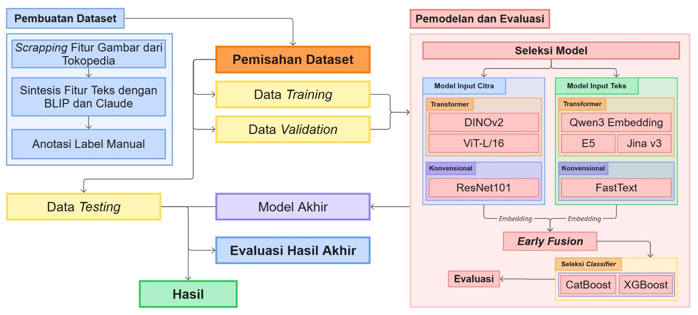

# Description

Proyek ini mengembangkan sistem otomatis untuk verifikasi klaim return-refund di marketplace menggunakan teknologi AI multimodal. Sistem ini dirancang untuk mengidentifikasi klaim palsu secara dini dengan menggabungkan analisis citra dan teks.

## Workflow Sistem



Diagram di atas menunjukkan alur kerja lengkap sistem kami, mulai dari pembuatan dataset hingga evaluasi model akhir. Proses dimulai dengan scraping fitur gambar dari Tokopedia, sintesis fitur teks menggunakan BLIP dan Claude, hingga anotasi label manual. Data kemudian dibagi menjadi training, validation, dan testing untuk pemodelan dan evaluasi menggunakan kombinasi model multimodal.

## Teknologi yang Digunakan

- **DINOv2 (self-DIstillation with NO labels)**: Model transformer state-of-the-art untuk pemrosesan dan representasi citra
- **Qwen3 Embedding**: Model embedding untuk representasi teks
- **Early Fusion**: Metode penggabungan multimodal untuk mengintegrasikan data citra dan teks
- **Gradient Boosting Tree**: Classifier untuk klasifikasi akhir

## Tujuan Sistem

1. **Verifikasi Otomatis**: Melakukan verifikasi dini terhadap klaim return-refund secara otomatis
2. **Deteksi Penipuan**: Mengidentifikasi klaim palsu
3. **Efisiensi Operasional**: Mengurangi waktu verifikasi manual oleh penjual dan tim customer service
4. **Penghematan Biaya**: Menurunkan biaya operasional melalui otomatisasi proses verifikasi

## Keunggulan

- **Multimodal**: Menganalisis data citra dan teks secara bersamaan untuk hasil yang lebih akurat
- **Real-time**: Proses verifikasi yang cepat untuk meningkatkan pengalaman pengguna
- **Scalable**: Dapat menangani volume klaim yang besar secara efisien

# How to use this model

Berikut adalah panduan lengkap untuk menggunakan model kami:

## 1. Instalasi Dependencies

```bash
pip install catboost torchvision transformers numpy pandas pillow joblib peft huggingface-hub
```

Atau instal semua dependencies dari file requirements:

```bash
pip install -r requirements.txt
```

## 2. Download Model

Download file model yang sudah ditraining dari repository ini:

```bash
# Download best_model.pkl
wget https://github.com/asShidqi/return-refund-prediction/raw/main/best_model.pkl
```

Atau download secara manual dari:
- [best_model.pkl](best_model.pkl)

## 2. Kode Implementasi

```python
# 1. Install dependencies
# !pip install catboost torchvision transformers numpy pandas pillow

import torch
import numpy as np
import pandas as pd
from PIL import Image
from joblib import load
from catboost import CatBoostClassifier
from transformers import AutoProcessor, AutoModel, AutoTokenizer

# 2. Load pretrained models
device = torch.device("cuda" if torch.cuda.is_available() else "cpu")

# DINOv2 for image
dino_model_name = "facebook/dinov2-large" 
dino_processor = AutoProcessor.from_pretrained(dino_model_name)
dino_model = AutoModel.from_pretrained(dino_model_name).to(device)
dino_model.eval()

# Qwen for text
text_model_name = "Qwen/Qwen3-Embedding-0.6B"  # adjust to your use case
text_tokenizer = AutoTokenizer.from_pretrained(text_model_name)
text_model = AutoModel.from_pretrained(text_model_name).to(device)
text_model.eval()

# CatBoost model
model = load("best_model.pkl")  # path to your trained model

# 3. Define embedding functions
def embed_image(image_path):
    image = Image.open(image_path).convert("RGB").resize((600, 600))
    inputs = dino_processor(images=image, return_tensors="pt").to(device)
    with torch.no_grad():
        features = dino_model(**inputs).last_hidden_state.mean(dim=1)
    return features.cpu().numpy().squeeze()

def embed_text(text):
    inputs = text_tokenizer(text, return_tensors="pt", padding=True, truncation=True).to(device)
    with torch.no_grad():
        outputs = text_model(**inputs)
        embeddings = outputs.last_hidden_state.mean(dim=1)
    return embeddings.cpu().numpy().squeeze()

# 4. Prepare your input
img_main_path = "example_main.jpg"
img_review_path = "example_review.jpg"
caption = "This is the product description from the user."

# 5. Embed each input
embed_main = embed_image(img_main_path)
embed_review = embed_image(img_review_path)
embed_caption = embed_text(caption)

# 6. Convert each to DataFrame columns
df_img_main_embed = pd.DataFrame(embed_main.reshape(1, -1), columns=[f"img_main_{i}" for i in range(embed_main.shape[0])])
df_img_review_embed = pd.DataFrame(embed_review.reshape(1, -1), columns=[f"img_review_{i}" for i in range(embed_review.shape[0])])
df_text_embed = pd.DataFrame(embed_caption.reshape(1, -1), columns=[f"text_feat_{i}" for i in range(embed_caption.shape[0])])

# 7. Combine all into one dataset
combine_dataset = pd.concat([df_img_main_embed, df_img_review_embed, df_text_embed], axis=1)

# 8. Predict
prediction = model.predict(combine_dataset)
print("Prediction:", prediction)
```

## 3. Input yang Diperlukan

- **img_main_path**: Path ke gambar produk utama
- **img_review_path**: Path ke gambar dari review/klaim
- **caption**: Deskripsi teks dari pengguna atau klaim

## 4. Output

Model akan memberikan prediksi berupa:
- `0`: Klaim palsu
- `1`: Klaim valid

# Implementasi Model Finetune

Berikut adalah kode implementasi setelah proses fine-tuning model:

```python
import torch
import torch.nn as nn
from transformers import AutoModel, AutoTokenizer, AutoImageProcessor
from peft import get_peft_model, PeftModel, LoraConfig
from PIL import Image
import numpy as np
import joblib
import catboost
from huggingface_hub import hf_hub_download

device = torch.device("cuda" if torch.cuda.is_available() else "cpu")

# -------------------------
# 1. Helper load image
# -------------------------
def load_image(path):
    return Image.open(path).convert("RGB")

# -------------------------
# 2. Define SiameseModel (projection head + backbone)
# -------------------------
class SiameseModel(nn.Module):
    def __init__(self, backbone, emb_dim=256, pool="cls", normalize=True):
        super().__init__()
        self.backbone = backbone
        self.pool = pool
        self.normalize = normalize
        hidden_size = getattr(backbone.config, "hidden_size", 1024)
        self.proj = nn.Sequential(
            nn.Linear(hidden_size, max(hidden_size // 2, emb_dim)),
            nn.ReLU(),
            nn.Dropout(0.1),
            nn.Linear(max(hidden_size // 2, emb_dim), emb_dim)
        )

    def _safe_forward(self, module, **kwargs):
        return module.forward(**kwargs)

    def encode(self, pixel: torch.Tensor):
        out = self._safe_forward(self.backbone, pixel_values=pixel, return_dict=True)
        if hasattr(out, "pooler_output") and out.pooler_output is not None:
            h = out.pooler_output
        else:
            h = out.last_hidden_state[:, 0, :]
        emb = self.proj(h)
        if self.normalize:
            emb = nn.functional.normalize(emb, dim=-1)
        return emb

# -------------------------
# 3. Load DINO backbone + LoRA + projection head
# -------------------------
backbone_dino = AutoModel.from_pretrained("facebook/dinov2-large")
lora_cfg = LoraConfig(
    r=8, lora_alpha=16, target_modules=["query","value"], lora_dropout=0.1,
    bias="none", task_type="FEATURE_EXTRACTION"
)
backbone_dino = get_peft_model(backbone_dino, lora_cfg)
backbone_dino.to(device)

# Load projection head + backbone weights
model_dino = SiameseModel(backbone_dino).to(device)
path_proj = hf_hub_download(
    repo_id="shidqii/dino-siamese-full",
    filename="siamese_model.pt"
)
state_dict = torch.load(path_proj, map_location=device)
model_dino.load_state_dict(state_dict)
model_dino.eval()

processor_dino = AutoImageProcessor.from_pretrained("facebook/dinov2-large")

# -------------------------
# 4. Load Qwen LoRA from HuggingFace
# -------------------------
tokenizer_qwen = AutoTokenizer.from_pretrained("shidqii/qwen-embed-lora")
base_model_qwen = AutoModel.from_pretrained("Qwen/Qwen3-Embedding-0.6B")
model_qwen_lora = PeftModel.from_pretrained(base_model_qwen, "shidqii/qwen-embed-lora")
model_qwen_lora.to(device)
model_qwen_lora.eval()

# -------------------------
# 5. Load CatBoost
# -------------------------
cat_model = joblib.load("best_model_finetune.pkl")

# -------------------------
# 6. Helpers embed image & text
# -------------------------
@torch.no_grad()
def embed_image(paths):
    imgs = [load_image(p) for p in paths]
    inputs = processor_dino(images=imgs, return_tensors="pt", padding=True).to(device)
    emb = model_dino.encode(inputs["pixel_values"])
    return emb.cpu().numpy()

@torch.no_grad()
def embed_caption(texts):
    embs = []
    for i in range(0, len(texts), 32):
        batch = texts[i:i+32]
        tokens = tokenizer_qwen(batch, padding=True, truncation=True, return_tensors="pt").to(device)
        out = model_qwen_lora.base_model(**tokens)
        last_hidden = out.last_hidden_state
        mask = tokens["attention_mask"].unsqueeze(-1).expand(last_hidden.size())
        mean_pooled = torch.sum(last_hidden * mask, 1) / torch.clamp(mask.sum(1), min=1e-9)
        embs.append(mean_pooled.cpu())
    return np.vstack(embs)

# -------------------------
# 7. Predict function
# -------------------------
def predict(img_main_path, img_review_path, caption):
    img_emb = embed_image([img_main_path, img_review_path])
    caption_emb = embed_caption([caption])[0]

    features = np.concatenate([img_emb[0], img_emb[1], caption_emb])
    return cat_model.predict([features])[0]

# -------------------------
# 8. Example usage
# -------------------------
result = predict(
    "image-main.png",
    "image-review.png",
    "caption"
)
print("Predicted label:", result)
```

## Penjelasan Kode Finetune

1. **Model Architecture**:
   - **SiameseModel**: Kombinasi backbone dan projection head untuk ekstraksi fitur gambar
   - **LoRA Configuration**: Parameter-Efficient Fine-Tuning (PEFT) untuk menyesuaikan model tanpa melatih seluruh parameter
   - **Early Fusion**: Penggabungan fitur dari gambar dan teks sebelum klasifikasi

2. **Komponen Utama**:
   - **DINOv2 dengan LoRA**: Untuk ekstraksi fitur gambar yang lebih kuat
   - **Qwen3 dengan LoRA**: Untuk embedding teks yang dioptimalkan untuk kasus penggunaan return-refund
   - **CatBoost Classifier**: Model final untuk klasifikasi dengan gabungan fitur multimodal

3. **Dependencies Tambahan**:
   - `peft`: Untuk Parameter-Efficient Fine-Tuning
   - `huggingface_hub`: Untuk mengunduh model terlatih dari repositori HuggingFace

4. **Instalasi Dependencies Tambahan**:

```bash
pip install peft huggingface_hub
```
